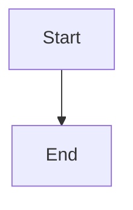
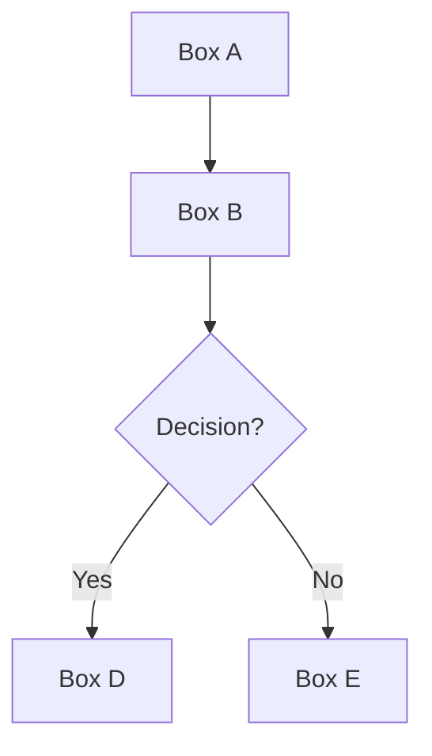
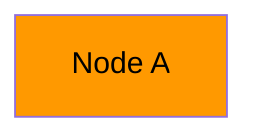

# Project Diagrams & Visualizations

This document explains all the visual diagrams available for the PDF to Text Chunks project.

## 📊 Available Diagrams

### 1. System Architecture (`architecture-diagram.mermaid`)
**Purpose:** High-level overview of how all components connect  
**Best for:** README intro, portfolio presentations, explaining the full system  
**Shows:**
- User interface layer
- AWS storage (S3 buckets)
- Compute layer (Lambda + Layer)
- Monitoring (CloudWatch)
- Both web and S3 trigger workflows

**Use in interviews:** "Here's the overall architecture - it's fully serverless..."

---

### 2. User Workflow (`user-workflow.mermaid`)
**Purpose:** Sequence diagram showing step-by-step user interaction  
**Best for:** Explaining UX flow, demonstrating error handling  
**Shows:**
- User actions from start to finish
- Request/response flow
- Rate limiting logic
- Success and error paths

**Use in interviews:** "When a user uploads a PDF, here's what happens..."

---

### 3. AWS Infrastructure (`aws-infrastructure.mermaid`)
**Purpose:** Detailed view of AWS resources and their relationships  
**Best for:** Technical discussions, infrastructure questions  
**Shows:**
- Specific AWS services used
- IAM roles and permissions
- Function URLs and triggers
- Resource names and configurations

**Use in interviews:** "I used Lambda with Function URLs for the API, S3 for storage..."

---

### 4. Data Flow (`data-flow.mermaid`)
**Purpose:** Shows how PDF data transforms into text chunks  
**Best for:** Explaining the processing logic  
**Shows:**
- Input validation
- Base64 encoding/decoding
- Text extraction process
- Cleaning and formatting steps
- Chunking algorithm
- Output options

**Use in interviews:** "The PDF goes through several transformation stages..."

---

### 5. Code Logic (`code-logic.mermaid`)
**Purpose:** Flowchart of the Lambda function decision tree  
**Best for:** Code walkthrough, explaining conditional logic  
**Shows:**
- Event type detection
- Rate limiting checks
- Error handling
- S3 vs Web paths
- Processing pipeline

**Use in interviews:** "The code first checks if it's an S3 trigger or web request..."

---

### 6. Cost Breakdown (`cost-breakdown.mermaid`)
**Purpose:** Visualizes AWS free tier usage and safety measures  
**Best for:** Explaining cost optimization, risk mitigation  
**Shows:**
- Free tier limits
- Actual usage (very low)
- Safety measures (alarms, limits)
- Cost: $0/month

**Use in interviews:** "I designed it to stay within the free tier permanently..."

---

### 7. Project Illustration (`project-illustration.svg`)
**Purpose:** Visual hero image showing the concept  
**Best for:** README header, presentations, quick understanding  
**Shows:**
- Input PDF
- Lambda processing
- Output chunks
- Key features

**Use in interviews:** Display as a slide or in portfolio

---

## 🎨 How to Use These Diagrams

### In Your README.md

```markdown
# PDF to Text Chunks


## Architecture

```mermaid
[paste architecture-diagram.mermaid content]
```
```

### In GitLab/GitHub
GitLab and GitHub both render Mermaid diagrams automatically in markdown files!

Just put the Mermaid code in triple backticks with `mermaid`:

````markdown

````

### In Presentations
1. **Mermaid diagrams:** Use [mermaid.live](https://mermaid.live) to convert to PNG/SVG
2. **SVG:** Can be opened directly in browsers or imported into PowerPoint/Keynote

### In Interviews

**Recommended order:**
1. Show `project-illustration.svg` - "Here's what it does"
2. Show `architecture-diagram.mermaid` - "Here's how it's built"
3. Show `user-workflow.mermaid` - "Here's the user experience"
4. Show `cost-breakdown.mermaid` - "Here's why it's cost-effective"

---

## 🛠️ Editing These Diagrams

### Mermaid Diagrams
Edit in any text editor, or use online tools:
- [Mermaid Live Editor](https://mermaid.live)
- [Mermaid Chart](https://mermaid.ink)

**Syntax:**


### SVG Diagrams
Edit in:
- [Figma](https://figma.com) (free)
- [Inkscape](https://inkscape.org) (free)
- Any text editor (it's XML)

---

## 📝 Adding to Your Git Repository

1. **Create a `diagrams/` folder:**
```bash
mkdir diagrams
```

2. **Move all diagram files there:**
```bash
mv *.mermaid diagrams/
mv *.svg diagrams/
```

3. **Reference in README.md:**
```markdown

```

4. **Commit:**
```bash
git add diagrams/
git commit -m "Add project diagrams and visualizations"
git push
```

---

## 🎯 Interview Talking Points

### When showing these diagrams:

**Architecture Diagram:**
- "I chose Lambda for serverless to minimize costs"
- "The dual-trigger design supports both web and automated workflows"
- "CloudWatch integration for monitoring and debugging"

**User Workflow:**
- "I implemented rate limiting to prevent abuse"
- "Error handling at multiple stages"
- "Base64 encoding for binary data transfer"

**Data Flow:**
- "Multi-stage text processing for better readability"
- "Smart chunking at paragraph boundaries, not mid-sentence"
- "Multiple output options for flexibility"

**Cost Breakdown:**
- "Designed to stay in free tier indefinitely"
- "Multiple safety measures to prevent surprise charges"
- "Cost-conscious architecture from day one"

**Code Logic:**
- "Single function handles multiple trigger types"
- "Defensive programming with validation at each step"
- "Clear separation of concerns"

---

## 🖼️ Export Options

### Export as PNG (for presentations)
1. Go to [mermaid.live](https://mermaid.live)
2. Paste your Mermaid code
3. Click "PNG" or "SVG" download button

### Export as PDF
1. Open SVG in browser
2. Print → Save as PDF
3. Or use online converter

---

## 📚 Learn More About Mermaid

- [Official Documentation](https://mermaid.js.org)
- [Syntax Cheat Sheet](https://jojozhuang.github.io/tutorial/mermaid-cheat-sheet/)
- [Examples](https://mermaid.js.org/ecosystem/integrations.html)

---

## ✨ Customizing Styles

### Change Colors in Mermaid:


### Color Palette Used:
- **Lambda Orange:** `#FF9900`
- **S3 Green:** `#569A31`
- **CloudWatch Pink:** `#FF4F8B`
- **Primary Blue:** `#667eea`
- **Secondary Purple:** `#764ba2`

---

## 💡 Tips for Job Applications

1. **Include at least 2-3 diagrams in README**
2. **Use architecture diagram in portfolio**
3. **Keep project-illustration.svg at the top of README**
4. **Reference diagrams when explaining in interviews**
5. **Shows you think visually and can communicate complex systems**

Diagrams demonstrate:
- ✅ Systems thinking
- ✅ Communication skills
- ✅ Attention to detail
- ✅ Professional presentation
- ✅ Understanding of the full stack
