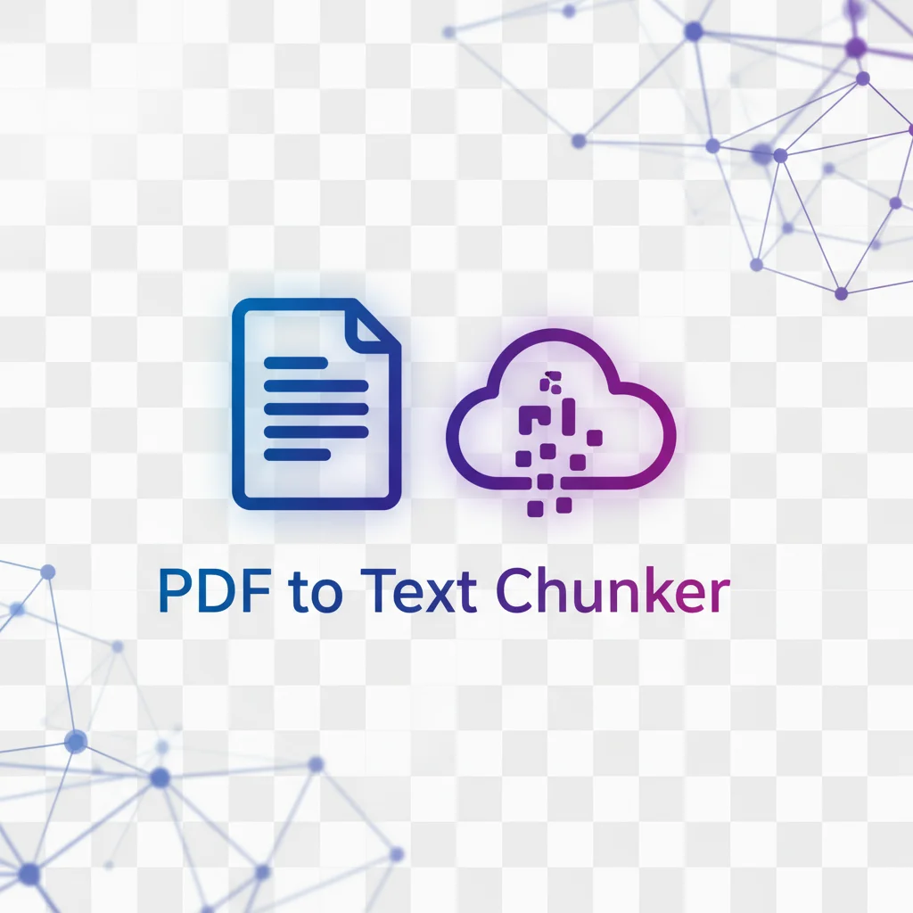

# PDF to Text Chunker

<div align="center">
  
  
  **Convert PDF files into email-friendly text chunks**
  
  [](https://aws.amazon.com/)
  [](https://www.python.org/)
  [](LICENSE)
</div>

---

## 🎯 Overview

A serverless application that converts PDF files into text chunks of 20,000 characters each, perfect for sharing via email or other platforms with character limits. Built with AWS Lambda and S3, designed to stay within the free tier permanently.

**Live Demo:** [PDF Chunker Web Interface](https://my-pdf-chunker-website.s3.us-east-2.amazonaws.com/pdf-chunker.html)

## ✨ Features

- 📄 **PDF Processing** - Extract text from PDF files with preserved formatting
- ✂️ **Smart Chunking** - Split text at paragraph boundaries (20,000 characters per chunk)
- 🌐 **Web Interface** - Drag-and-drop upload with instant processing
- 🔄 **S3 Trigger Support** - Automated processing for files uploaded to S3
- 📋 **Copy to Clipboard** - One-click copying of text chunks
- 💾 **Download Support** - Save chunks as .txt files
- 🛡️ **Rate Limiting** - Built-in protection (10 PDFs/hour per IP)
- 💰 **Cost Optimized** - Designed to stay $0/month on AWS free tier

## 🏗️ Architecture

```
User Upload → Lambda Function URL → PyPDF2 Processing
     ↓
Text Extraction → Smart Chunking → JSON Response
     ↓
Web Interface → Copy/Download
```

**Alternative S3 Flow:**
```
S3 Upload → Event Trigger → Lambda Processing → Output to S3
```

## 🚀 Quick Start

### Using the Web Interface

1. Visit the [live site](https://my-pdf-chunker-website.s3.us-east-2.amazonaws.com/pdf-chunker.html)
2. Drag and drop your PDF file (max 6MB)
3. Wait for processing (usually 2-5 seconds)
4. Copy chunks to clipboard or download as .txt files

### Using S3 Direct Upload

1. Upload PDF to: `s3://my-pdf-input-bucket-dave/`
2. Lambda automatically processes the file
3. Download chunks from: `s3://my-pdf-output-bucket-dave/`

## 📦 Tech Stack

- **Backend:** AWS Lambda (Python 3.13)
- **Storage:** AWS S3
- **PDF Library:** PyPDF2
- **Frontend:** Vanilla JavaScript + HTML/CSS
- **Deployment:** AWS CLI + Bash Scripts

## 🛠️ Installation & Deployment

See [SETUP.md](SETUP.md) for detailed instructions on:
- AWS account setup
- Lambda function configuration
- S3 bucket creation
- Deployment automation

**Quick Deploy:**
```bash
# Clone the repository
git clone https://github.com/dave-schmidt-dev/pdf-chunker.git
cd pdf-chunker

# Configure AWS CLI
aws configure

# Deploy everything
./deploy.sh
```

## 📊 AWS Resources

- **Lambda Function:** `PDFToTextChunker`
- **S3 Buckets:** 
  - `my-pdf-input-bucket-dave` (input)
  - `my-pdf-output-bucket-dave` (output)
  - `my-pdf-chunker-website` (web hosting)
- **Region:** us-east-2 (Ohio)

## 💡 How It Works

1. **Upload:** PDF sent as Base64 to Lambda Function URL
2. **Extract:** PyPDF2 extracts text from PDF
3. **Clean:** Text formatting improved (paragraphs, speaker names)
4. **Chunk:** Split into 20k character segments at paragraph boundaries
5. **Return:** JSON with chunks, character counts, and metadata

## 📈 Usage & Costs

**Typical Monthly Usage:**
- Lambda requests: ~12/month
- S3 storage: ~5MB
- CloudWatch logs: ~1MB
- **Total cost: $0.00** (within free tier)

**Free Tier Limits:**
- Lambda: 1M requests/month
- S3: 5GB storage, 20k requests
- Data transfer: 1GB/month

## 🔒 Security

- Rate limiting: 10 PDFs/hour per IP
- CloudWatch billing alarm at $5
- Lambda concurrency limit: 10
- No authentication (public access)
- No persistent storage

## 📝 Known Limitations

- Max file size: 6MB
- No OCR support (scanned PDFs won't work)
- Rate limiting resets on Lambda cold starts
- Complex PDF formatting may not preserve perfectly

## 🤝 Contributing

See [CONTRIBUTING.md](CONTRIBUTING.md) for guidelines.

## 📄 License

MIT License - see [LICENSE](LICENSE) for details

## 🙏 Acknowledgments

Built with assistance from Claude (Anthropic) for architecture design, troubleshooting, and deployment automation.

## 📞 Contact

**Developer:** David Schmidt  
**GitHub:** [@dave-schmidt-dev](https://github.com/dave-schmidt-dev)

##📁 Repository Files
Complete index of all files in this repository with direct access links:

###📄 Documentation
FileDescriptionDirect LinkREADME.mdProject overview and quick startViewSETUP.mdComplete AWS setup guideViewPROJECT_SUMMARY.mdComprehensive project documentationViewPROJECT_FILES.mdFile-by-file documentationViewCHANGELOG.mdVersion history and updatesViewCONTRIBUTING.mdContribution guidelinesViewLICENSEMIT LicenseView

###💻 Source Code
FileDescriptionDirect Linklambda_function.pyAWS Lambda function (Python 3.13)Viewpdf-chunker.htmlWeb interface (HTML/CSS/JS)Viewdeploy.shAutomated deployment scriptView

###⚙️ Configuration Files
FileDescriptionDirect Linkrequirements.txtPython dependenciesView.env.exampleEnvironment variable templateView.gitignoreGit exclusionsView

###🎨 Assets
FileDescriptionDirect Linklogo.pngProject logo (PNG, 379KB)Viewlogo.webpOptimized logo (WEBP, 23KB)View

###📊 Diagrams
All architectural diagrams and visualizations:
FileDescriptionDirect LinkDIAGRAMS.mdDiagram documentationViewarchitecture-diagram.mermaidSystem architectureViewaws-infrastructure.mermaidAWS resources layoutViewcode-logic.mermaidProcessing logic flowViewcost-breakdown.mermaidCost analysisViewdata-flow.mermaidData flow diagramViewuser-workflow.mermaidUser interaction flowViewproject-illustration.svgProject illustrationView

Note: All files are viewable in their raw format for easy inspection and integration with other tools.
---

<div align="center">
  <sub>Built for portfolio demonstration | AWS Serverless Architecture | Free Tier Optimized</sub>
</div>
